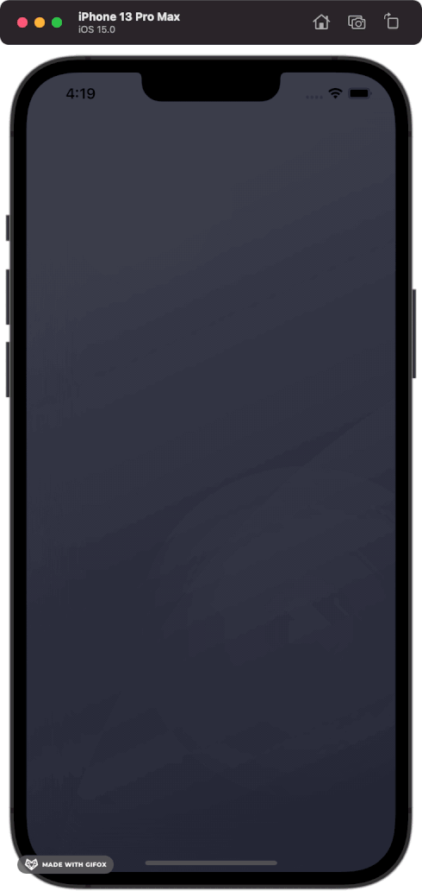

# Maestro

Build complex, conducted animations declaratively without manually managing state.

|Code|
|---|

```swift
struct AnimatedPieChart: View {

    private enum Trim<T>: AnimationKey {
        typealias Value = Double
    }

    private enum FirstSegmentStart { }
    private enum FirstSegmentEnd { }
    private enum SecondSegmentStart { }
    private enum SecondSegmentEnd { }
    private enum ThirdSegmentStart { }
    private enum ThirdSegmentEnd { }

    @State private var conductor = AnimationConductor(.concurrent, delay: 5) {
        Animate<Trim<FirstSegmentEnd>>(to: 0.96, curve: .easeInOut, duration: 2.5)
        Animate<Trim<FirstSegmentStart>>(to: 0.62, curve: .easeInOut, duration: 1.5)
            .delayed(by: 1)
        AnimateConcurrently {
            Animate<Trim<SecondSegmentEnd>>(to: 0.58, curve: .easeInOut, duration: 1.25)
            Animate<Trim<SecondSegmentStart>>(to: 0.33, curve: .easeInOut, duration: 0.75)
                .delayed(by: 0.5)
        }
        .delayed(by: 1.25)
        AnimateConcurrently {
            Animate<Trim<ThirdSegmentEnd>>(to: 0.29, curve: .easeInOut, duration: 0.75)
            Animate<Trim<ThirdSegmentStart>>(to: 0.18, curve: .easeInOut, duration: 0.5)
                .delayed(by: 0.25)
        }
        .delayed(by: 1.75)
    }

    var body: some View {
        ConductedView($conductor) { context in
            ZStack {
                AnimatableArc(padding: 32)
                    .trim(from: context[Trim<FirstSegmentStart>.self], to: context[Trim<FirstSegmentEnd>.self])
                    .stroke(style: StrokeStyle(lineWidth: 36, lineCap: .round, lineJoin: .round))
                    .foregroundColor(.pink)
                    .shadow(radius: 8)
                AnimatableArc(padding: 32)
                    .trim(from: context[Trim<SecondSegmentStart>.self], to: context[Trim<SecondSegmentEnd>.self])
                    .stroke(style: StrokeStyle(lineWidth: 36, lineCap: .round, lineJoin: .round))
                    .foregroundColor(.orange)
                    .shadow(radius: 8)
                AnimatableArc(padding: 32)
                    .trim(from: context[Trim<ThirdSegmentStart>.self], to: context[Trim<ThirdSegmentEnd>.self])
                    .stroke(style: StrokeStyle(lineWidth: 36, lineCap: .round, lineJoin: .round))
                    .foregroundColor(.purple)
                    .shadow(radius: 8)
            }
        }
    }

}
```
    
|Result|
|---|

<p align="center">
    
</p>

## Getting Started

Documentation is a work-in-progress and I am experimenting with setting up DocC documentation via GitHub pages (which may or may not be possible.) There are some varying code examples available
under the [documentation resources folder](Documentation.docc/Resources). Along with releases you can find the exported DocC archive, which you can download and open with Xcode's documentation
browser. The DocC documentation currently includes the information automatically generated from the source code's header documentation.

### Important

Maestro is currently in a pre-release state, specifically because it [uses a private API for timing functions](Sources/Maestro-ObjC/include/CAMediaTimingFunction+Solving.h). There are solutions
available publicly which don't involve using a private API, so once timing functions are rewritten the library will be production-ready. You can still use the library for experimentation or hobby
projects, but including it in a production project comes with inherent risk.

## Requirements

### SDK

* Xcode 13.1
* Swift 5.5

### Deployment targets

* iOS 14.0+
* tvOS 14.0+
* watchOS 7.0+
* macOS 11.0+

## Installation

### Swift Package Manager

From an Xcode project, you can find the interface for adding a Swift package under the Xcode project's "Swift Packages" tab. Once there, search for the URL of this reposistory, and follow the dialogs to add it to your project.

Add the following dependency to your `Package.swift` file:

```swift
.package(url: "https://github.com/rpwachowski/maestro", from: "0.1.0")
```

Then, include it as a dependency of your target:

```swift
// swift-tools-version:5.5

import PackageDescription

let package = Package(
    name: "Example",
    dependencies: [
        .package(url: "https://github.com/rpwachowski/maestro", from: "0.1.0")
    ],
    targets: [
        .target(name: "Example", dependencies: ["Maestro"])
    ]
)
```

### Carthage

###### Not yet implemented

### Cocoapods

###### Not yet implemented
